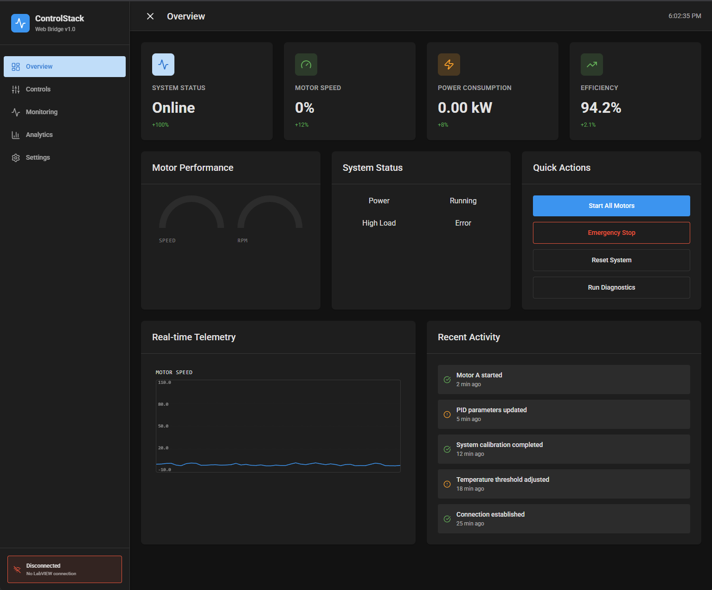

# ControlStack Web Bridge v2.0

**Modern Web-Based HMI/SCADA Interface for LabVIEW**

ControlStack Web Bridge is a robust framework connecting LabVIEW applications with modern React web interfaces. It allows you to build beautiful, responsive, and interactive HMI dashboards using standard web technologies while maintaining the power and reliability of LabVIEW availability.



---

## 🚀 Key Features

*   **Bidirectional Communication:** Seamless real-time data sync between LabVIEW and React.
*   **Modern UI Components:** Includes a suite of industrial UI widgets (Gauges, Knobs, Charts, Tanks) built with Tailwind CSS and Framer Motion.
*   **Tag-Based System:** Simple key-value pair architecture for easy data mapping.
*   **Developer Friendly:** Type-safe React hooks (`useLabVIEW`) and comprehensive TypeScript support.
*   **Zero-Dependency LabVIEW:** Uses the native WebView control (LabVIEW 2026Q1+), no external WebSocket servers required.

---

## 📋 Table of Contents

1. [Getting Started](#getting-started)
2. [LabVIEW Integration Guide](#labview-integration-guide)
3. [Component Standards & Development](#component-standards--development)
4. [Troubleshooting](#troubleshooting)

---

## 🛠 Getting Started

### Prerequisites

*   **LabVIEW** 2026Q1 or later (with WebView control support)
*   **Node.js** 18+ and npm
*   **Modern Web Browser** (Chrome, Edge, Firefox)

### Installation

1.  **Clone the repository:**
    ```bash
    git clone https://github.com/your-username/controlstack-web-bridge.git
    cd controlstack-web-bridge
    ```

2.  **Install dependencies:**
    ```bash
    npm install
    ```

3.  **Start development server:**
    ```bash
    npm run dev
    ```
    Open `http://localhost:5173` to view the dashboard.

4.  **Build for production:**
    ```bash
    npm run build
    ```
    The output will be in the `dist/` folder, ready to be loaded by LabVIEW or hosted.

---

## 🔌 LabVIEW Integration Guide

### System Architecture

The system uses a bridge pattern where the LabVIEW WebView control executes JavaScript to push data, and the web app triggers LabVIEW User Events to send commands.

```
┌─────────────────┐         ┌──────────────────┐         ┌─────────────────┐
│   LabVIEW VI    │ ◄─────► │  WebView Control │ ◄─────► │  React Web App  │
│                 │         │  (Execute JS)    │         │  (Components)   │
└─────────────────┘         └──────────────────┘         └─────────────────┘
```

### Connection Protocol

#### 1. Handshake
LabVIEW must initiate the connection by sending its User Event Refnum to the web app.
**LabVIEW Call:** `window.labviewBridge.setRefnum(12345)`

#### 2. Sending Data (LabVIEW → Web)
Use the `updateState` function to push JSON data.
**LabVIEW Call:** `window.labviewBridge.updateState('{"tag":"Motor_Speed","value":75.5}')`

> **CRITICAL:** Do NOT send raw JSON. You must wrap it in the `updateState` function call.

#### 3. Receiving Data (Web → LabVIEW)
The web app automatically fires User Events when interactive controls are changed.
**React Hook:**
```typescript
const [speed, setSpeed] = useLabVIEW<number>('Motor_Speed', 0);
// Calling setSpeed(50) triggers the LabVIEW User Event
```

### LabVIEW Setup Steps

1.  **Create User Event:** Create a User Event (Data Type: String) in your Main VI.
2.  **Register Event:** Register the event to generate an **Event Registration Refnum**.
3.  **Initialize WebView:**
    *   Load the URL (`http://localhost:5173` or `file:///.../dist/index.html`).
    *   Wait for load to complete.
    *   Call `Execute JavaScript` with `window.labviewBridge.setRefnum(Refnum)`.
4.  **Main Loop:**
    *   **Write:** Build JSON strings for your tags and call `window.labviewBridge.updateState(...)`.
    *   **Read:** Use an Event Structure to handle the User Event. Parse the incoming JSON string (`{"tag":"...", "data":...}`) to process commands.

---

## 🧩 Component Standards & Development

We follow a modular **Standardized Component Architecture** to ensure maintainability.

### Directory Structure

```
src/
├── components/         # Reusable UI widgets ("dumb" components)
│   ├── index.ts        # Barrel export file
│   ├── StatCard.tsx    # Standard KPI display
│   ├── ContentCard.tsx # Standard layout container
│   ├── NumericKnob.tsx # Industrial control
│   └── ...
├── views/              # Page layouts
│   ├── Overview.tsx    # Main dashboard view
│   └── Controls.tsx    # Control panel view
├── hooks/              # Custom Hooks
│   └── useLabVIEW.ts   # Main data binding hook
└── lib/                # Core Logic
    └── bridge.ts       # Communication bridge singleton
```

### Styling Guidelines

All components use standard **Material Design CSS Variables** defined in `src/index.css`.
*   **Colors:** `var(--md-primary)`, `var(--md-success)`, `var(--md-warning)`, `var(--md-error)`
*   **Surfaces:** `var(--md-surface)`, `var(--md-surface-hover)`
*   **Text:** `var(--md-text-primary)`, `var(--md-text-secondary)`

### Creating New Components

1.  Create a "dumb" component in `src/components/` that accepts `value` and `onChange` props.
2.  Use `ContentCard` to wrap it in your View.
3.  Connect it using `useLabVIEW`.

```tsx
// Example View Usage
<ContentCard title="Motor A">
    <NumericKnob
        value={speed}
        onChange={setSpeed} // Connected via useLabVIEW
        label="RPM"
    />
</ContentCard>
```

---

## ❓ Troubleshooting

### "Disconnected" status in Web App
*   **Check Refnum:** Verify LabVIEW is actually calling `setRefnum`.
*   **Refresh:** If using Hot Module Reloading (HMR), refresh the page in the WebView.
*   **Check Console:** Open the browser developer tools (or enable debugging in WebView) to see errors.

### Data Not Updating
*   **Raw JSON Mistake:** Ensure you are sending `window.labviewBridge.updateState(...)` and not just a raw JSON string.
*   **Tag Mismatch:** Tag names are case-sensitive. Check for typos.

### "Refnum: null" despite Connected
This can happen during development if the page reloads but LabVIEW doesn't re-send the handshake.
*   **Fix:** Restart the LabVIEW VI or include a "Reconnect" button in LabVIEW to resend the handshake.

---

## License

MIT License. See [LICENSE](LICENSE) for details.
